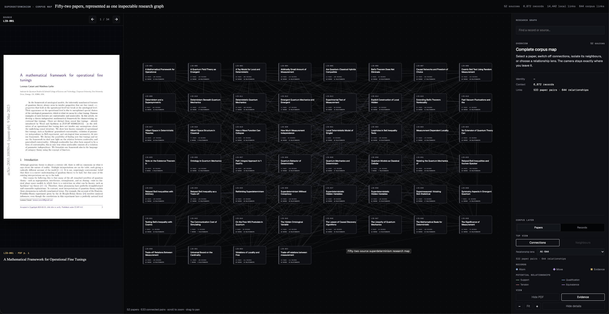
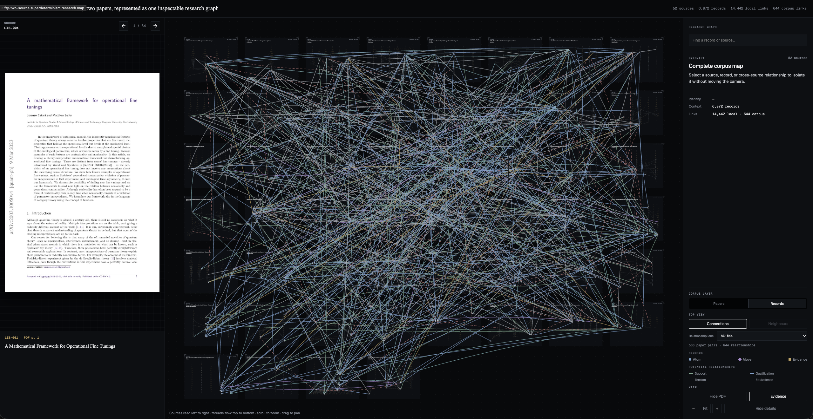
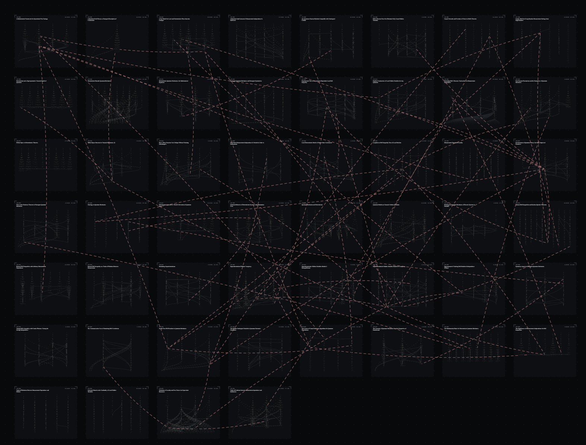
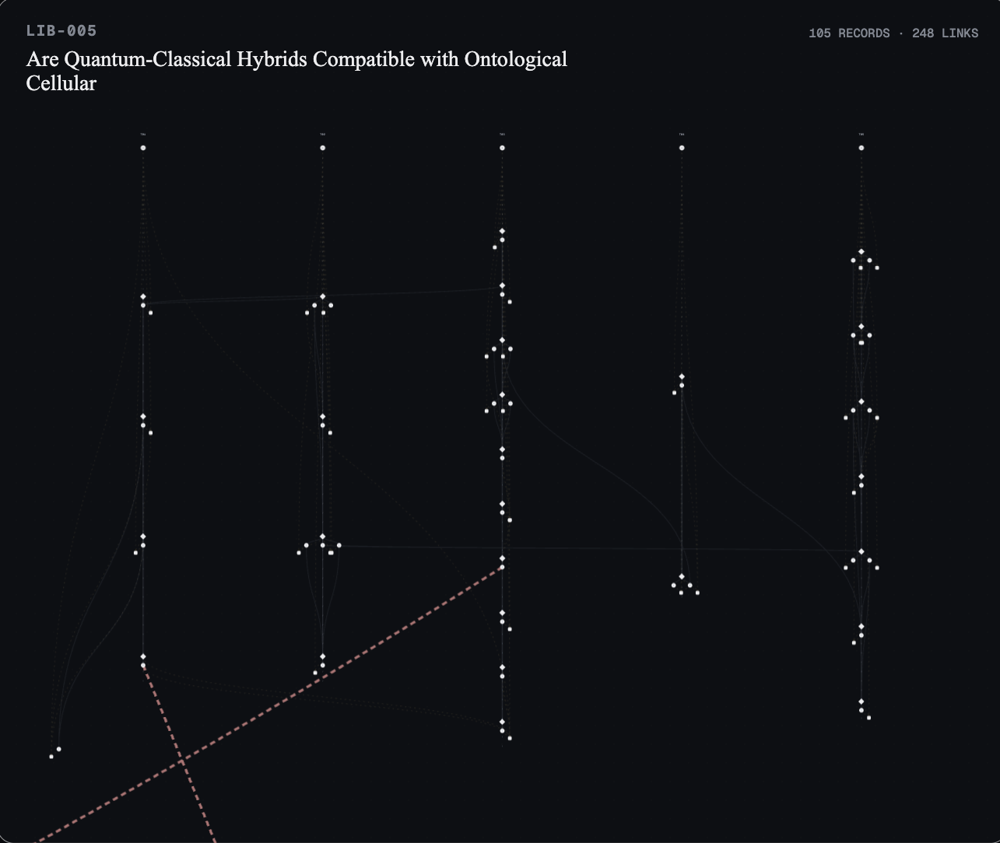

# Agentic Research Workspace

An open-source workspace where researchers and agents develop research
together—and publish it as an inspectable research pack, not only a PDF.

**Experimental alpha.** Literature mapping is the first implemented part.
The living research workspace, project-wide coordinator and research-pack
publisher are being designed; they are not available features yet.

[Quick start](#try-it-without-a-model) · [Roadmap](docs/public-roadmap/README.md) ·
[Architecture](docs/architecture/README.md) · [Contributing](CONTRIBUTING.md) ·
[Experimental release](https://github.com/Liaust/agentic-research-workspace/releases/tag/v0.1.0-alpha.1)



*The first testing corpus: 52 papers represented as an inspectable literature
map. This screenshot shows the private research viewer, not an application
bundled with the alpha. The underlying papers and evidence-bearing graph are
not redistributed.*

## What works today

- **Evidence-linked literature records:** preserve what each source says as
  exact evidence spans, semantic atoms, reasoning moves and argument threads.
- **Deterministic validation and compilation:** check record structure,
  identity and references, then compile canonical Markdown into graphs.
- **Qualified cross-source relationships:** represent potential support,
  qualification, equivalence and tension without deciding scientific truth.
- **Human and agent inspection:** search an explicitly selected graph and
  explore stable record IDs with evidence and local context; JSON is available.
- **Experimental pipeline tooling:** source registration, reading/audit
  coordination, corpus runs, cross-referencing and recovery code and protocols.

The easiest supported entry point is the **model-free source-checkout demo**
below. Real-corpus/model workflows remain advanced experiments and require
your own inputs, configuration and review. There is no hosted service or
complete research IDE in this release.

## Try it without a model

Requires **Python 3.12+**, Git and [uv](https://docs.astral.sh/uv/getting-started/installation/).
No API key, model subscription or private corpus is needed for these commands.

```sh
git clone https://github.com/Liaust/agentic-research-workspace.git
cd agentic-research-workspace
uv sync --frozen --all-groups
uv run python -m research_map.demo --output build/synthetic-study
```

Expected: **6 synthetic records, 9 links, zero model calls.**

The [invented source](examples/synthetic-study/source.md) and
[manually authored dossier](examples/synthetic-study/dossier.md) describe a
timing pattern and why it does not establish causation. The demo validates
their relationship and compiles a graph; it does **not** pretend to extract
new knowledge with a model.

Follow the limitation back to its evidence and argument:

```sh
uv run research-map search "causation" --graph build/synthetic-study/graph.json
uv run research-map explore --id LIB-903:atom:causal-limit --graph build/synthetic-study/graph.json --json
```

Inspect the generated dossier, graph, context envelopes and hash receipt in
`build/synthetic-study/`. Exact reruns are safe; changed outputs are not
overwritten. See the [walkthrough](examples/synthetic-study/README.md).

To inspect a relationship between two invented sources:

```sh
uv run research-map explore --id LIB-901:atom:indicator-response --graph reference_mapping_graph/synthetic-example/graph.json --json
```

[Command discovery](commands.json) provides explicit arguments for agents.
Use `uv run research-map --help` for the broader experimental CLI.
For the reproducible alpha, check out tag `v0.1.0-alpha.1` before installing;
`main` receives ongoing development.

## How literature becomes a map

```text
immutable source
  → exact evidence
  → source-local assertions, reasoning moves and threads
  → validated canonical Markdown
  → compiled graph and qualified cross-source relationships
  → human navigation and agent queries
```

The graph is a projection, not a second truth store. A source's own assertion
is never merged away to manufacture consensus. Relationships inferred by the
mapper remain explicitly potential. Schema validity is not scientific
correctness or proof that a source was interpreted faithfully.

## What the maps look like



*From a paper overview to the record layer: the frozen testing baseline
contains 6,872 records, 14,442 source-local links and 644 potential
cross-source relationships.*

<table>
  <tr>
    <td width="58%"></td>
    <td width="42%"></td>
  </tr>
  <tr>
    <td><strong>Relationship lens.</strong> Inspect potential tensions without turning them into scientific verdicts.</td>
    <td><strong>Source detail.</strong> Keep a paper's internal reasoning visible.</td>
  </tr>
</table>

Superdeterminism is a **testing corpus**, not the project's identity or domain
limit. These four approved screenshots illustrate a private run. The viewer
itself is not bundled yet; a public, rights-safe viewer is on the roadmap.

The published aggregate baseline retained 52 of 53 registered sources. Its
audit depth is uneven: 35 sources remain unaudited/provisional, 11 were audited
with findings, five passed audit and one audit was interrupted. Counts measure
retained output, not completeness or correctness.
[Baseline details](reference_mapping_graph/baseline-v1/README.md).

## Where this is going

Today we reconstruct structure from already-published papers. The long-term
goal is to preserve richer structure **as research happens**.

| Part | Purpose | Status |
|---|---|---|
| Literature map | Understand sources, evidence, arguments and their relationships | Experimental implementation |
| Living research workspace | Organize evolving questions, notes, derivations, code, data, experiments and decisions | Design stage |
| Published research pack | Release a curated, versioned representation that humans and agents can inspect and reuse | Design stage |

The living workspace may retain incomplete, provisional and private material.
A published pack is a **selected, checked release**, not a dump of that
workspace. Humans might read a narrative and navigate a graph; agents might
resolve stable IDs, inspect provenance and retrieve reproducible artifacts.
Both should reach the same underlying published records.

We are designing that publication target first, then working backward to the
capture workflow. The intended operating model is one project-wide coordinator
agent that can delegate focused work and integrate its returns. Whole-project
access does not grant unlimited publication or action authority.

Read the [workspace/pack design](docs/architecture/WORKSPACE_AND_PACK.md) and
the [outcome roadmap](docs/public-roadmap/README.md).

## Limits and privacy

- This is a research prototype, not an autonomous scientist or a production IDE.
- Search is lexical; exploration is bounded. Neither adjudicates a claim.
- The full private corpus and graph are not included. Their scientific content
  cannot be independently evaluated from aggregate counts or screenshots.
- The alpha is supported from a source checkout; a self-contained package
  installation is not yet supported.
- Later long-form ingestion/recovery work is not included in this baseline.
- Public code does not make anyone's research public. Keep real working data
  outside this software checkout.

[Limitations](docs/limitations/README.md) ·
[Publication policy](docs/publication/PUBLICATION_POLICY.md) ·
[Third-party rights](THIRD_PARTY_RIGHTS.md)

## Develop with us

Development of the general system happens here. Start with a reproducible bug,
a rights-safe example, a navigation improvement or a concrete research-pack
question. The [contribution guide](CONTRIBUTING.md) covers setup, tests and
the boundaries that changes must preserve.

The original code and documentation are [Apache-2.0 licensed](LICENSE).
This grants no license to third-party papers or the private graph.
[Citation metadata](CITATION.cff) is included.
